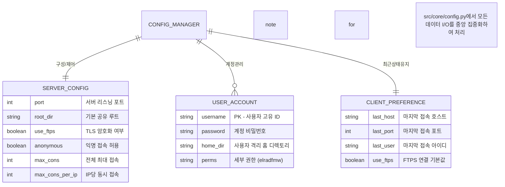

# 🚀 SimpleFTP Pro: 통합 모듈형 FTP 솔루션

**SimpleFTP Pro**는 현대적인 소프트웨어 아키텍처를 기반으로 설계된 전문적인 통합 FTP 서버 및 클라이언트 애플리케이션입니다. 고품질의 **인라인 UX/UI**와 **모듈화된 내부 구조**를 통해 서버 관리와 파일 전송을 단 하나의 인터페이스에서 완벽하게 처리합니다.

---

## 💎 핵심 차별점 (Core Features)

1.  **혁신적인 인라인 UX/UI**: 별도의 팝업 대화상자 없이, 리스트 더블 클릭만으로 사용자를 즉시 편집할 수 있는 대시보드형 디자인을 제공합니다.
2.  **고수준 모듈화 아키텍처**: GUI(Tkinter), 핵심 로직(Core), 네트워크(Network) 계층이 완벽히 분리되어 있어 유지보수와 기능 확장이 매우 용이합니다.
3.  **지능형 환경 자동화 (Self-Healing)**: 시스템 실행 시 설정 파일의 무결성을 검사하고, 유실된 경우 최적의 템플릿으로 JSON 설정을 자동 복구합니다.
4.  **강력한 엔터프라이즈 보안**: FTPS (TLS/SSL) 암호화와 IP당 접속 제한, 무차별 대입 공격 방지 기능을 기본 탑재하여 안전한 데이터 전송을 보장합니다.

---

## 📊 시스템 데이터 구조 (Enhanced ERD)

본 프로젝트는 JSON 기반의 데이터 영속성 레이어를 사용하며, 아래와 같은 구조로 데이터가 유기적으로 연동됩니다.



---

## 📂 프로젝트 계층 구조

```text
simftp/
├── src/                    # 애플리케이션 소스 루트
│   ├── main.py             # 시스템 진입점 및 부팅 로직
│   ├── app.py              # 전체 앱 프레임워크 및 라우팅
│   ├── core/               # 시스템 커널 및 비즈니스 로직
│   │   ├── config.py       # JSON 데이터 퍼시스턴시 관리 (Manager)
│   │   ├── setup.py        # 초기 환경 구성 및 자가 복구 엔진
│   │   └── utils.py        # 네트워크 유틸리티 및 SSL 생성기
│   ├── gui/                # 사용자 인터페이스 레이어
│   │   └── tabs/           # 모듈화된 독립 기능 탭 (Server, Client)
│   └── network/            # 하위 레벨 네트워크 프로토콜 처리
├── config/                 # 영구 저장 데이터 (JSON, 인증서)
├── run.bat                 # Windows 원클릭 실행 스크립트
├── run.sh                  # Unix/macOS 실행 스크립트
└── README.md               # 프로젝트 공식 가이드
```

---

## 🚀 빠른 시작 가이드

사용자의 운영체제에 맞는 스크립트를 실행하면 가상환경(venv) 생성부터 프로그램 실행까지 모든 과정이 자동으로 진행됩니다.

### 🪟 Windows 사용자
- `run.bat` 파일을 더블 클릭하여 실행하십시오.

### 🍎 macOS 및 🐧 Linux 사용자
```bash
# 실행 권한 부여 후 실행
chmod +x run.sh
./run.sh
```

---

## 🔐 보안 및 운영 가이드

- **인라인 편집**: 사용자 목록에서 계정을 **더블 클릭**하면 우측 패널에서 즉시 정보를 수정할 수 있습니다.
- **SSL 인증서**: FTPS 기능을 처음 활성화할 때 인증서가 없다면 시스템이 자동으로 2048비트 RSA 자가 서명 인증서를 생성합니다.
- **권한 상세**: `e(접속)`, `l(목록)`, `r(읽기)`, `w(쓰기)`, `a(추가)`, `d(삭제)`, `f(이름변경)`, `m(폴더생성)`의 세밀한 제어가 가능합니다.

---

## 📝 라이선스 및 배포
이 프로젝트는 교육 및 실무 참조용으로 자유롭게 수정 및 배포가 가능합니다. 오직 한글로 최적화된 문서를 지향합니다.
