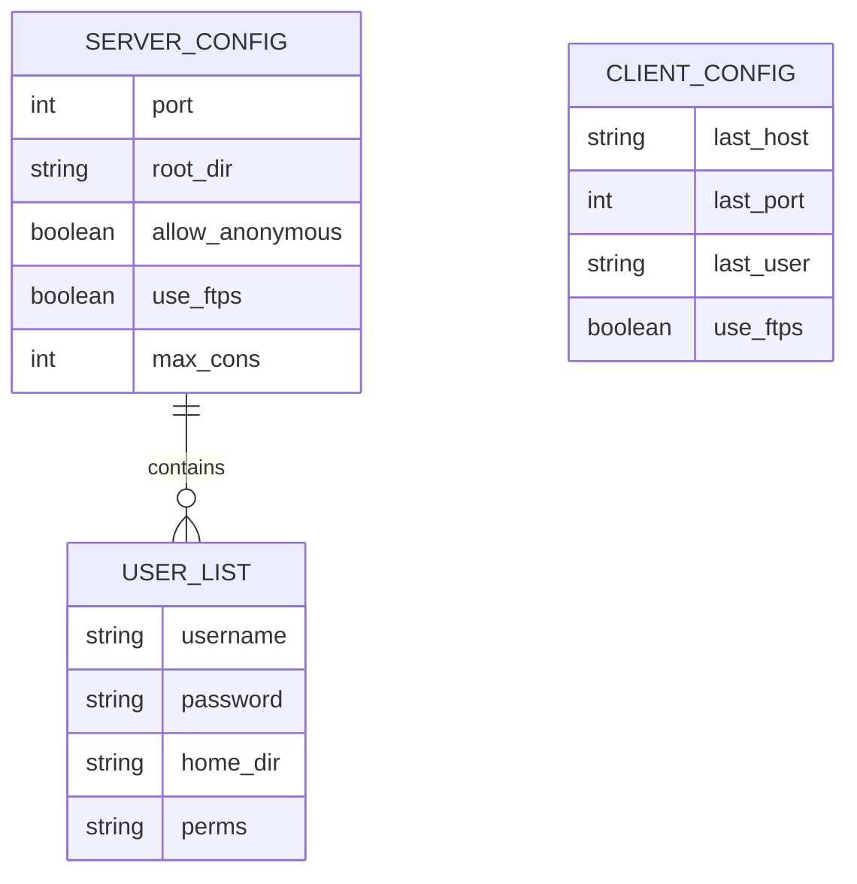

# 🚀 SimpleFTP Pro

심플하고 강력한 통합 FTP 서버 및 클라이언트 솔루션입니다. Python과 `pyftpdlib`, `tkinter`를 사용하여 제작되었으며, 직관적인 **인라인 UX/UI**를 통해 초보자도 쉽게 서버를 운영하고 파일을 관리할 수 있습니다.

---

## ✨ 주요 기능

- **통합 대시보드**: 서버 제어와 클라이언트 기능을 탭 하나로 전환.
- **인라인 사용자 관리**: 팝업창 없이 리스트에서 즉시 계정 추가 및 권한 수정 가능.
- **강력한 보안(FTPS)**: TLS/SSL 암호화 전송 및 자가 서명 인증서 자동 생성 지원.
- **JSON 기반 설정 자동화**: 모든 설정이 JSON으로 관리되며, 실행 시 자동으로 템플릿을 생성.
- **세부 권한 제어**: 사용자별 전용 홈 디렉토리 및 8단계 세부 권한(읽기, 쓰기, 삭제 등) 설정.

---

## 📊 데이터 구조 (ERD 개념도)

본 프로젝트는 관계형 DB 대신 JSON 파일 시스템을 사용하여 데이터를 관리합니다. 각 파일 간의 논리적 관계는 다음과 같습니다.



---

## 📂 프로젝트 구조

```text
simftp/
├── src/                    # 모든 소스 코드
│   ├── main.py             # 애플리케이션 실행 메인 (설정 체크 포함)
│   ├── init_configs.py     # JSON 템플릿 자동 생성 스크립트
│   ├── config_manager.py   # JSON 데이터 로드/저장 관리
│   ├── server_tab.py       # 인라인 UI가 적용된 서버 탭
│   └── client_tab.py       # FTP 클라이언트 탭
├── config/                 # 자동 생성되는 설정 파일 (JSON, CRT, KEY)
│   ├── server_config.json
│   ├── users.json
│   └── client_config.json
├── venv/                   # 가상 환경
└── README.md               # 프로젝트 설명서 (한글)
```

---

## 🚀 시작하기

### 1. 의존성 설치
```bash
pip install pyftpdlib pyopenssl
```

### 2. 실행
```bash
python src/main.py
```
*실행 시 `config/` 폴더와 기본 JSON 파일들이 존재하지 않으면 자동으로 생성됩니다.*

---

## 🛠️ 개발 가이드

- **인라인 편집**: 사용자 목록에서 ID를 **더블 클릭**하면 오른쪽 편집기에서 즉시 정보를 수정할 수 있습니다.
- **보안**: FTPS 활성화 시 인증서가 없다면 프로그램이 자동으로 자가 서명 인증서를 생성합니다.
- **데이터 관리**: `src/config_manager.py`를 통해 모든 설정 파일의 무결성을 유지합니다.

---

## 📝 라이선스

이 프로젝트는 학습 및 실무 참조용으로 자유롭게 사용할 수 있습니다.
