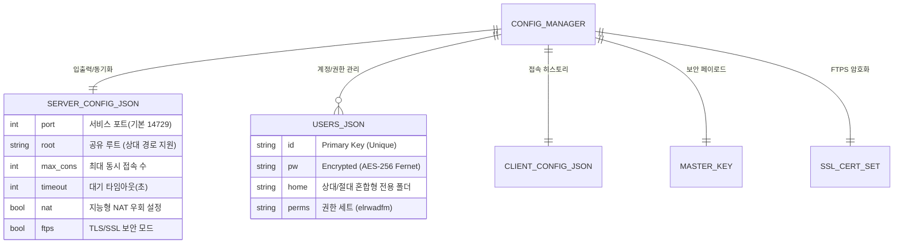

# 🖥️ simftp: Intelligent FTP Server & Client

**simftp**는 강력한 보안과 지능형 자동화 기능을 갖춘 통합 FTP 솔루션입니다. 특히 모든 경로를 **프로젝트 루트 기준의 상대 경로**로 관리하는 **휴대용(Portable) 아키텍처**를 채택하여, 폴더를 어디로 옮겨도 설정 수정 없이 즉시 작동합니다.

---

## 📊 시스템 아키텍처 및 데이터 구조

### 1. 지능형 데이터 엔티티 관계도 (ERD)
중앙 집중식 `ConfigManager`가 모든 설정과 보안 자산을 상대 경로 기반으로 안전하게 통합 관리합니다.

### 2. 고정밀 상대 경로 시스템 (Portable Architecture)
*   **Zero-Configuration**: 설정 파일 내의 모든 경로가 현재 실행 위치를 기준으로 자동 계산됩니다.
*   **Home Path Inheritance**: 사용자 홈 디렉토리가 서버 루트 하위일 경우 자동으로 `./user`와 같은 상대 경로로 저장되어 루트 이동 시 함께 계승됩니다.
*   **Independent Roots**: 필요한 경우 서버 루트 바깥의 절대 경로(예: 외장하드)도 사용자별로 독립적으로 할당할 수 있습니다.

---

## 🛡️ 멀티 레이어 보안 및 엔진 설정

| 보안 계층 | 기술 사양 | 설명 |
| :--- | :--- | :--- |
| **엔진 정밀 제어** | **Pyftpdlib Tuning** | 최대 접속 수, IP당 제한, 타임아웃을 GUI에서 1초 만에 튜닝 가능합니다. |
| **비밀번호 보안** | **AES-256 Symmetric** | `master.key`를 통한 양방향 암호화로 보안성과 관리 편의성을 동시에 확보합니다. |
| **전송 보안** | **TLS/SSL (FTPS)** | 데이터 가로채기(Sniffing)를 방지하는 강력한 터널링 전송을 지원합니다. |
| **접속 제어** | **Anti-Brute Force** | 무단 접근 시도 시 강제 차단 및 초당 접속 제한을 수행합니다. |

---

## 🎨 사용자 인터페이스 및 경험 (UI/UX)

*   **📝 지능형 경로 제안 시스템**: 새 계정 아이디를 입력하는 즉시, 서버 루트 내 해당 이름의 폴더를 자동으로 추천하여 입력 수고를 덜어줍니다.
*   **📜 실시간 한글 이벤트 로그**: 모든 서버 활동을 한국어로 번역하고 상황별 아이콘(📥, 📤, 🔑, 🗑️)과 타임스탬프를 붙여 직관적인 모니터링이 가능합니다.
*   **🌔 고대비 로그 모니터링 (Dark Mode)**: 배경색 `#1e1e1e` 기반의 다크 테마 로그 창으로 장시간 감시 시 시력을 보호합니다.
*   **💾 원스톱 인라인 편집기**: 복잡한 창 전환 없이 계정 목록에서 더블 클릭만으로 즉시 정보를 수정하고 권한을 변경할 수 있습니다.

---

## 🌐 네트워크 및 포트 설정

외부 접속을 위해 공유기 설정에서 아래 포트들을 이 PC의 내부 IP로 연결(포트 포워딩)해야 합니다.

| 항목 | 프로토콜 | 포트 범위 | 용도 |
| :--- | :--- | :--- | :--- |
| **제어 채널** | TCP | **14729** | 접속 및 명령어 제어 |
| **데이터 채널** | TCP | **60000 ~ 60100** | 파일 리스트 및 실제 전송용 (Passive) |

---

## 📂 프로젝트 상세 구조

| 경로 | 구분 | 특징/목적 |
| :---: | :---: | :--- |
| 📁 `src/` | **Source** | 프로그램의 핵심 로직 및 GUI 구현체 |
| 📁 `config/` | **Data** | **보안 민감 데이터** (사용자 정보, 암호화 키, SSL 인증서) |
| 📁 `simftp_share/` | **Storage** | 기본 FTP 공유 루트 디렉토리 (자동 생성됨) |
| 📄 `run.bat` | **Runner** | 윈도우 환경 전용 원클릭 실행 스크립트 |

---

## 🚀 시작하기

1. **설치**: `run.bat` 실행 시 필요한 라이브러리(`pyftpdlib`, `cryptography` 등)를 자동 체크합니다.
2. **서버 시작**: **Server 탭**에서 유저를 추가(추가 시 홈 폴더 자동 제안 확인)하고 가동 버튼을 누르세요.
3. **상대 경로 확인**: 서버 루트를 바꾸면 기존 유저들의 경로도 "당연히" 따라가며 로그에 실제 경로가 표시됩니다.
4. **엔진 튜닝**: **Settings 탭**에서 최대 접속 수 등의 정밀 설정을 내 환경에 맞게 조정하세요.
