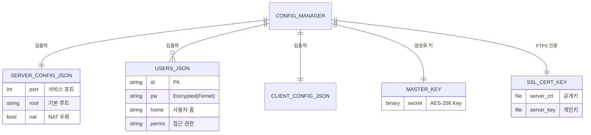
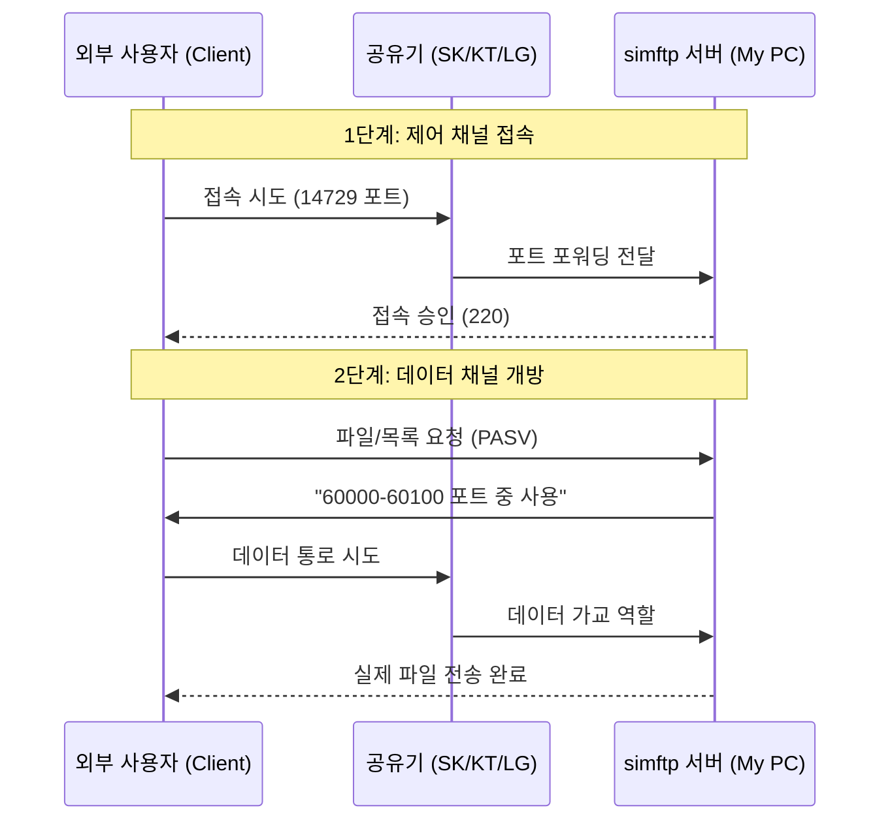

# simftp

**simftp**는 현대적인 소프트웨어 아키텍처를 기반으로 설계된 통합 FTP 서버 및 클라이언트 애플리케이션입니다. 고품질의 **인라인 UX/UI**와 **모듈화된 내부 구조**를 통해 서버 관리와 파일 전송을 단 하나의 인터페이스에서 완벽하게 처리합니다.

---

## 📊 시스템 아키텍처 및 데이터 구조

### 1. 데이터 엔티티 관계도 (ERD)
본 프로젝트는 중앙 집중식 설정 관리자를 통해 데이터의 일관성을 유지합니다.

### 1. 데이터 엔티티 관계도 (ERD)
본 프로젝트는 중앙 집중식 설정 관리자를 통해 모든 데이터를 JSON 및 보안 전용 파일로 관리합니다.

---

### 2. NAT 환경 접속 흐름도 (Network Flow)
외부망에서 내부의 simftp 서버로 접근할 때의 데이터 흐름입니다.

---

## 🛡️ 강화된 보안 시스템 (Security)
안전한 파일 관리를 위해 다음과 같은 다층 보안 기술이 적용되어 있습니다.

*   **🔒 양방향 암호화**: 모든 계정 비밀번호는 **AES-256 알고리즘과 고유 마스터 키**를 사용하여 암호화 저장됩니다.
*   **🛡️ 브루트 포스 방지**: 로그인 3회 실패 시 해당 세션을 즉시 차단합니다.
*   **🚦 도스(DoS) 방어**: 전체 동시 접속 50명, IP당 5개로 제한하여 서버 자원 고갈을 방지합니다.
*   **🔐 FTPS 지원**: TLS/SSL 기반 암호화 전송을 통해 패킷 스니핑을 방지합니다.
*   **⏰ 자동 재시작 스케줄러**: 매일 00:01(KST)에 서버를 자동 재시작하여 바뀐 공인 IP를 자동 갱신합니다.

---

## 🌐 NAT 및 외부 접속 가이드 (Port Forwarding)
공유기 환경에서 외부 접속을 위해 아래 **두 설정**을 공유기에 등록해야 합니다.

| 구분 | 프로토콜 | 포트 범위 | 대상 IP | 용도 |
| :--- | :--- | :--- | :--- | :--- |
| **명령 채널** | TCP | 14729 | 내 PC (.61) | 명령 및 응답 제어 |
| **데이터 채널** | TCP | 60000 ~ 60100 | 내 PC (.61) | 파일 전송 및 목록 표시 |

---

## 🛠️ 설정 및 유지보수 (Settings)
설정 탭을 통해 시스템의 핵심 보안 요소를 안전하게 관리할 수 있습니다.

*   **⚠️ 위험 구역 관리**: 마스터 키 및 SSL 인증서를 수동으로 초기화/재생성할 수 있습니다.
*   **🚨 3단계 강화 컨펌**: 치명적인 데이터 초기화 작업은 **3회 연속 경고(1/3, 2/3, 3/3)**를 모두 승인해야 실행됩니다.
*   **📦 상대 경로 기반 관리**: 모든 설정 파일과 키는 실행 위치를 기준으로 하는 **상대 경로(JSON)**에서 안전하게 관리됩니다.

---

## 📂 프로젝트 상세 구조
| 파일/디렉토리 | 목적 | 특징 |
| :--- | :--- | :--- |
| `src/main.py` | 프로그램 진입점 | 환경 초기화 및 GUI 시작 |
| `src/app.py` | 메인 프레임워크 | 탭 관리 및 인터페이스 연결 |
| `src/core/config.py` | 설정 관리자 | 모든 JSON 파일의 중앙 제어 |
| `src/core/utils.py` | 보안/네트워크 유틸 | AES 암호화, SSL 생성, IP 조회 |
| `src/gui/tabs/` | UI 컴포넌트 | 서버, 클라이언트, 설정 독립 구성 |
| `config/*.json` | 데이터 저장소 | 서비스 설정, 사용자 목록, 클라이언트 기록 |
| `config/master.key` | 마스터 암호키 | 비밀번호 복호화에 필요한 핵심 키 |
| `config/server.*` | SSL 인증서 세트 | 안전한 전송(FTPS)을 위한 공개/개인키 |

---

## 🚀 시작하기
1. `run.bat`를 실행하여 프로그램을 켭니다.
2. **Server** 탭에서 사용자 계정을 생성하고 서버를 가동합니다.
3. 공유기 설정에서 포트포워딩 및 **내부 IP 예약(DHCP)**을 완료하세요.
4. 매일 00:01에 서버가 자동 재시작되므로 유동 IP 환경에서도 안심하고 사용하세요.
