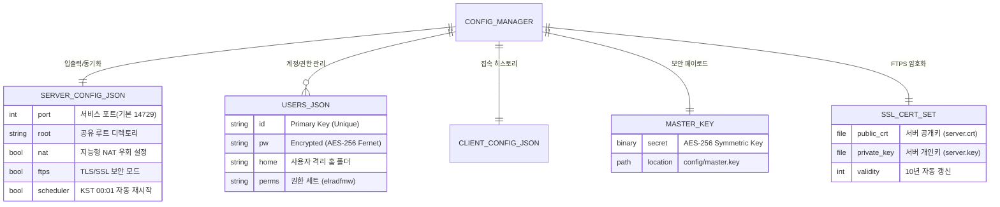
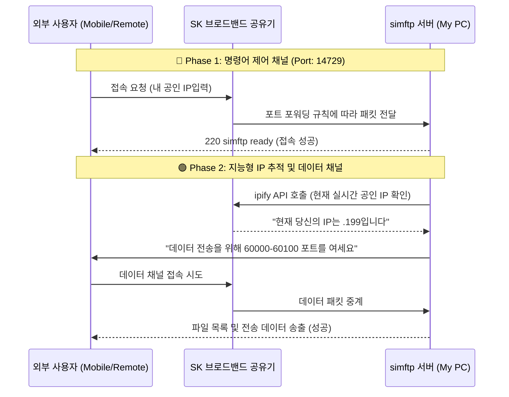

# 🖥️ simftp: Intelligent FTP Server & Client

**simftp**는 강력한 보안과 지능형 자동화 기능을 갖춘 통합 FTP 솔루션입니다. 유동 IP 환경에서의 번거로운 관리 업무를 자동화하고, AES-256 기반의 강력한 보안 체계로 소중한 데이터를 보호합니다. 단일 인터페이스에서 서버 제어와 클라이언트 전송을 모두 완벽하게 처리할 수 있습니다.

---

## 📊 시스템 아키텍처 및 데이터 구조

### 1. 지능형 데이터 엔티티 관계도 (ERD)
중앙 집중식 `ConfigManager`가 모든 설정과 보안 자산을 상대 경로 기반으로 안전하게 통합 관리합니다.

### 2. NAT/공유기 환경 데이터 흐름 (Network Flow)
외부망 사용자가 공유기를 거쳐 내부 PC로 접속하는 복잡한 단계를 simftp가 지능적으로 중계합니다.

---

## 🛡️ 멀티 레이어 보안 시스템

| 보안 계층 | 기술 사양 | 설명 |
| :--- | :--- | :--- |
| **비밀번호 보안** | **AES-256 Symmetric** | `master.key`를 통한 양방향 암호화로 관리자는 암호 확인이 가능하되, 파일 유출 시에는 안전합니다. |
| **전송 보안** | **TLS/SSL (FTPS)** | 데이터 가로채기(Sniffing)를 방지하는 강력한 터널링 전송을 지원합니다. |
| **접속 제어** | **Anti-Brute Force** | 로그인 3회 연속 실패 시 강제 연결 해제 및 동시 접속 수 제한(IP당 5개)을 수행합니다. |
| **운영 보안** | **3-Step Warning** | 마스터 키 초기화 등 위험 작업 시 `1/3, 2/3, 3/3` 단계별 경고창을 통해 실수를 방지합니다. |
| **무결성 유지** | **Auto-Keygen** | 마스터 키나 인증서 분실 시 시스템이 스스로 감지하여 보안 자산을 즉시 재생성합니다. |

---

## ⏰ 지능형 자동화 (Intelligent Automation)

*   **📅 KST 기반 재시작 스케줄러**: 한국 표준시(UTC+9) 기준 **매일 새벽 00:01**에 서버를 자동으로 재시작합니다.
*   **📡 실시간 공인 IP 갱신**: 서버 재시작 시점에 `ipify` JSON API와 캐시 방지(Cache Busting) 기술을 사용하여 통신사가 강제로 할당한 새로운 IP를 즉시 감지합니다.
*   **♻️ 세션 자가 치유**: 네트워킹 오류 발생 시 서버가 스스로를 중지 후 재기동하여 항상 최상의 응답 속도를 유지합니다.

---

## 🌐 포트 포워딩 필수 설정

유동 IP/NAT 환경에서 외부 접속을 위해 공유기 관리 페이지(`192.168.45.1`)에 반드시 등록해야 하는 필수 규칙입니다.

| 항목 | 프로토콜 | 외부/내부 포트 | 대상 내부 IP | 설명 |
| :--- | :--- | :--- | :--- | :--- |
| **FTP 커맨드** | TCP | **14729** | `192.168.45.61` | 접속 및 명령어 전송용 |
| **Passive 데이터** | TCP | **60000 ~ 60100** | `192.168.45.61` | 파일 전송 및 목록 표시 (필수) |

---

## 📂 프로젝트 상세 구조

| 경로 | 구분 | 파일/디렉토리 명 | 특징/목적 |
| :---: | :---: | :--- | :--- |
| 📁 | **Source** | `src/` | 프로그램의 모든 실행 소스 코드 |
| 📄 | Entry | `src/main.py` | 프로그램의 시작점 및 시스템 초기화 |
| 📄 | Frame | `src/app.py` | UI 탭 시스템 및 메인 루프 관리 |
| 📁 | **Core** | `src/core/` | 설정, 보안 유틸, IP 조회 엔진 |
| 📁 | **UI** | `src/gui/tabs/` | 서버 제어, 클라이언트, 보안 설정 각 탭 컴포넌트 |
| 📁 | **Data** | `config/` | **.gitignore 제외 대상** (사용자 데이터, 보안키, 인증서) |
| 📄 | Config | `config/*.json` | 서비스 설정 및 사용자 계정 정보 |
| 📄 | Key | `config/master.key` | 모든 보안의 핵심 (암호화용 대칭키) |
| 📄 | Script | `run.bat` | 환경 변수 체크 및 원클릭 실행 스크립트 |

---

## 🚀 시작하기

1. **설치 및 실행**: `run.bat` 파일을 실행하면 필요한 라이브러리 체크 후 자동으로 프로그램이 켜집니다.
2. **첫 서버 가동**: **Server 탭**에서 유저를 추가하고 `Start Server` 버튼을 누르세요.
3. **보안 설정**: **설정 탭**에서 매일 새벽 자동 재시작 기능이 켜져 있는지 확인하세요. (기본 활성화)
4. **외부 접속**: 핸드폰 LTE를 켜고 화면에 표시된 **공인 IP(.199)**를 입력하여 접속 테스트를 진행하세요.
