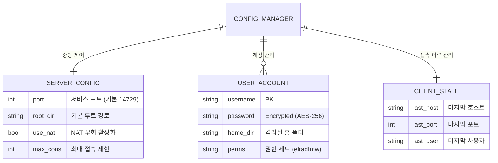
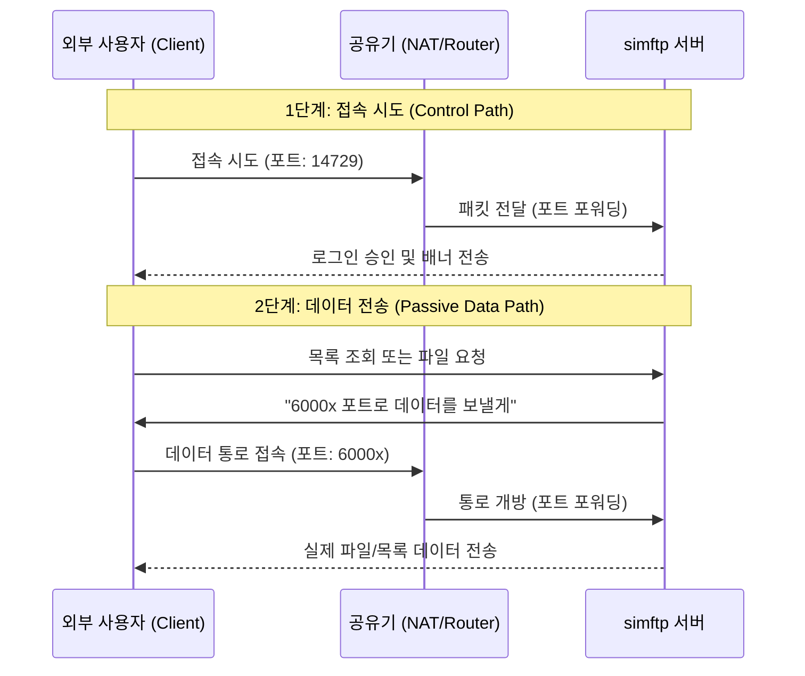

# simftp

**simftp**는 현대적인 소프트웨어 아키텍처를 기반으로 설계된 통합 FTP 서버 및 클라이언트 애플리케이션입니다. 고품질의 **인라인 UX/UI**와 **모듈화된 내부 구조**를 통해 서버 관리와 파일 전송을 단 하나의 인터페이스에서 완벽하게 처리합니다.

---

## 📊 시스템 아키텍처 및 데이터 구조

### 1. 데이터 엔티티 관계도 (ERD)
본 프로젝트는 중앙 집중식 설정 관리자를 통해 데이터의 일관성을 유지합니다.



### 2. NAT 환경 접속 흐름도 (Network Flow)
외부망에서 내부의 simftp 서버로 접근할 때의 데이터 흐름입니다.



---

## 🛡️ 강화된 보안 시스템 (Security)
안전한 파일 관리를 위해 다음과 같은 다층 보안 기술이 적용되어 있습니다.

*   **🔒 양방향 암호화**: 모든 계정 비밀번호는 **AES-256 알고리즘과 고유 마스터 키**를 사용하여 암호화 저장됩니다. 관리자는 필요 시 암호를 복호화하여 확인할 수 있습니다.
*   **🛡️ 브루트 포스 방지**: 로그인 3회 실패 시 해당 연결을 즉시 차단합니다.
*   **🚦 도스(DoS) 방어**: 서버 전체 동시 접속 50명, IP당 5개로 제한하여 서버 자원 고발을 방지합니다.
*   **🔐 FTPS 지원**: TLS/SSL 기반 암호화 전송을 통해 패킷 스니핑을 방지합니다.
*   **📜 활동 로그 동기화**: 터미널에 출력되는 모든 시스템 로그가 GUI 활동 로그창에 **100% 실시간 동기화** 출력됩니다.
*   **⏰ 자동 재시작 스케줄러**: 매일 00:01(KST)에 서버를 자동으로 재시작하여 시스템 안정성과 공인 IP 갱신을 보장합니다.

---

## 🌐 NAT 및 외부 접속 가이드 (Port Forwarding)
공유기 환경에서 외부 접속을 위해 아래 **두 설정**을 공유기에 등록해야 합니다.

| 설정 항목 | 프로토콜 | 포트 범위 | 내부 IP | 용도 |
| :--- | :--- | :--- | :--- | :--- |
| **Command** | TCP | 14729 | 내 PC IP | 접속 및 명령어 제어 |
| **Data** | TCP | 60000 ~ 60100 | 내 PC IP | 파일 전송 및 목록 표시 |

---

## 🛠️ 설정 및 유지보수 (Settings)
새롭게 추가된 **설정 탭**을 통해 시스템의 핵심 보안 요소를 관리할 수 있습니다.

*   **📅 서버 관리 스케줄링**: 매일 정해진 시간(00:01 KST)에 서버를 자동으로 재시작하도록 설정할 수 있습니다. 유동 IP 사용자를 위한 편의 기능입니다.
*   **⚠️ 위험 구역**: 마스터 키 및 SSL 인증서 초기화 기능을 제공합니다.
*   **🚨 3단계 컨펌**: 마스터 키 초기화와 같이 위험한 작업은 사용자의 실수를 방지하기 위해 **3번의 연속된 확인 절차**를 거쳐야 실행됩니다.

---

## 📂 프로젝트 폴더 구조
```text
simftp/
├── src/
│   ├── main.py         # 진입점
│   ├── app.py          # 메인 프레임워크
│   ├── core/           # 핵심 엔진 (설정, 보안, 유틸)
│   └── gui/tabs/       # UI 컴포넌트 (Server, Client, Settings)
├── config/             # 데이터 저장소 (JSON, SSL 인증서, Master Key)
├── run.bat             # 윈도우 원클릭 실행
└── README.md           # 공식 문서
```

---

## 🚀 시작하기
1. `run.bat`를 실행하여 프로그램을 켭니다.
2. **Server** 탭에서 사용자 계정을 생성하고 서버를 가동합니다.
3. 외부 접속이 필요한 경우 리드미의 **NAT 가이드**를 참고하여 공유기를 설정하세요.
