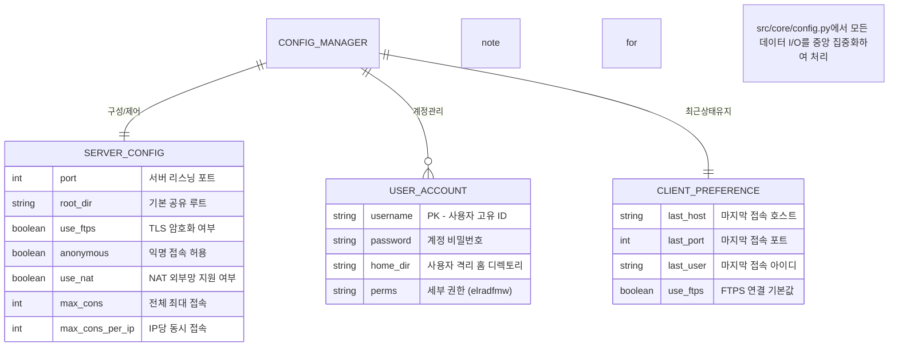

# 🚀 SimpleFTP Pro: 통합 모듈형 FTP 솔루션

**SimpleFTP Pro**는 현대적인 소프트웨어 아키텍처를 기반으로 설계된 전문적인 통합 FTP 서버 및 클라이언트 애플리케이션입니다. 고품질의 **인라인 UX/UI**와 **모듈화된 내부 구조**를 통해 서버 관리와 파일 전송을 단 하나의 인터페이스에서 완벽하게 처리합니다.

---

## 💎 핵심 차별점 (Core Features)

1.  **혁신적인 인라인 UX/UI**: 별도의 팝업 대화상자 없이, 리스트 더블 클릭만으로 사용자를 즉시 편집할 수 있는 대시보드형 디자인을 제공합니다.
2.  **고수준 모듈화 아키텍처**: GUI(Tkinter), 핵심 로직(Core), 네트워크(Network) 계층이 완벽히 분리되어 있어 유지보수와 기능 확장이 매우 용이합니다.
3.  **지능형 환경 자동화 (Self-Healing)**: 시스템 실행 시 설정 파일의 무결성을 검사하고, 유실된 경우 최적의 템플릿으로 JSON 설정을 자동 복구합니다.
4.  **외부망 접속 최적화 (NAT Support)**: 공인 IP 실시간 조회 및 NAT Masquerading 기능을 탑재하여 공유기 환경에서도 안정적인 외부 접속을 지원합니다.
5.  **보안 강화 인퍼테이스**: 암호 보기/숨기기 토글, 포트 수정 잠금 장치 등을 통해 운영 실수와 보안 노출을 최소화했습니다.

---

## 📊 시스템 데이터 구조 (Enhanced ERD)

본 프로젝트는 JSON 기반의 데이터 영속성 레이어를 사용하며, 아래와 같은 구조로 데이터가 유기적으로 연동됩니다.



---

## 📂 프로젝트 계층 구조

```text
simftp/
├── src/                    # 애플리케이션 소스 루트
│   ├── main.py             # 시스템 진입점 및 부팅 로직
│   ├── app.py              # 전체 앱 프레임워크 및 라우팅
│   ├── core/               # 시스템 커널 및 비비즈니스 로직
│   │   ├── config.py       # JSON 데이터 퍼시스턴시 관리 (Manager)
│   │   ├── setup.py        # 초기 환경 구성 및 자가 복구 엔진
│   │   └── utils.py        # 네트워크 유틸리티 및 IP/SSL 엔진
│   ├── gui/                # 사용자 인터페이스 레이어
│   │   └── tabs/           # 모듈화된 독립 기능 탭 (Server, Client)
│   └── network/            # 하위 레벨 네트워크 프로토콜 처리
├── config/                 # 영구 저장 데이터 (JSON, 인증서)
├── run.bat                 # Windows 원클릭 실행 스크립트
├── run.sh                  # Unix/macOS 실행 스크립트
└── README.md               # 프로젝트 공식 가이드
```

---

## 🚀 빠른 시작 가이드

사용자의 운영체제에 맞는 스크립트를 실행하면 가상환경(venv) 생성부터 프로그램 실행까지 모든 과정이 자동으로 진행됩니다.

### 🪟 Windows 사용자
- `run.bat` 파일을 더블 클릭하여 실행하십시오. (자동으로 `venv`를 구성하고 앱을 띄웁니다.)

### 🍎 macOS 및 🐧 Linux 사용자
```bash
# 실행 권한 부여 후 실행
chmod +x run.sh
./run.sh
```

---

## 🔐 세부 기능 상세 가이드

### 1. 포트 및 네트워크 설정
- **기본 포트**: 보안과 편의를 고려한 **14729** 포트를 기본값으로 사용합니다.
- **포트 잠금 매커니즘**: 실수로 포트가 바뀌는 것을 방지하기 위해 입력란이 선명한 **읽기 전용**으로 고정되어 있습니다. 수정을 원하시면 옆의 `[수정]` 체크박스를 활성화하십시오.
- **공인 IP 조회**: 서버 탭 상단에서 현재 내 컴퓨터의 로컬 IP와 외부 접속용 공인 IP를 실시간으로 확인할 수 있습니다.

### 2. 계정 관리 (인라인 대시보드)
- **계정 로드**: 왼쪽 목록의 사용자 아이디를 **더블 클릭**하십시오.
- **권한 제어**: `r(읽기)`, `w(쓰기)`, `d(삭제)` 등 8단계의 세밀한 권한 설정이 가능합니다.
- **보안**: 계정 편집 및 클라이언트 접속 시 비밀번호 필드 옆의 눈 아이콘(체크박스)을 눌러 암호 노출 여부를 제어할 수 있습니다.

### 3. 외부 접속 지원 (NAT/Port Forwarding)
- **NAT 모드**: 공유기 환경에서 외부 접속이 안 될 경우 `NAT/외부접속 지원` 옵션을 체크하십시오.
- **포트 포워딩**: 외부 접속을 위해서는 공유기 설정에서 14729번 포트를 내 컴퓨터 IP로 포워딩해야 합니다.

---

## 📝 라이선스 및 배포
이 프로젝트는 교육 및 실무 참조용으로 자유롭게 수정 및 배포가 가능합니다. 기술적 문의나 버그 제보는 GitHub Issue를 활용해 주십시오. 쾌적한 한글 환경을 보장합니다.
