# 🖥️ simftp: Intelligent FTP Server & Client

**simftp**는 강력한 보안과 지능형 자동화 기능을 갖춘 통합 FTP 솔루션입니다. 유동 IP 환경에서의 번거로운 관리 업무를 자동화하고, AES-256 기반의 강력한 보안 체계로 소중한 데이터를 보호합니다. 단일 인터페이스에서 서버 제어와 클라이언트 전송을 모두 완벽하게 처리할 수 있습니다.

---

## 📊 시스템 아키텍처 및 데이터 구조

### 1. 지능형 데이터 엔티티 관계도 (ERD)
중앙 집중식 `ConfigManager`가 모든 설정과 보안 자산을 상대 경로 기반으로 안전하게 통합 관리합니다.

```mermaid
erDiagram
    CONFIG_MANAGER ||--|| SERVER_CONFIG_JSON : "입출력/동기화"
    CONFIG_MANAGER ||--o{ USERS_JSON : "계정/권한 관리"
    CONFIG_MANAGER ||--|| CLIENT_CONFIG_JSON : "접속 히스토리"
    CONFIG_MANAGER ||--|| MASTER_KEY : "보안 페이로드"
    CONFIG_MANAGER ||--|| SSL_CERT_SET : "FTPS 암호화"

    SERVER_CONFIG_JSON {
        int port "서비스 포트(기본 14729)"
        string root "공유 루트 디렉토리"
        bool nat "지능형 NAT 우회 설정"
        bool ftps "TLS/SSL 보안 모드"
        bool scheduler "KST 00:01 자동 재시작"
    }

    USERS_JSON {
        string id "Primary Key (Unique)"
        string pw "Encrypted (AES-256 Fernet)"
        string home "사용자 격리 홈 폴더"
        string perms "권한 세트 (elradfmw)"
    }

    MASTER_KEY {
        binary secret "AES-256 Symmetric Key"
        path location "config/master.key"
    }

    SSL_CERT_SET {
        file public_crt "서버 공개키 (server.crt)"
        file private_key "서버 개인키 (server.key)"
        int validity "10년 자동 갱신"
    }
```

### 2. NAT/공유기 환경 데이터 흐름 (Network Flow)
외부망 사용자가 인터넷 공유기(Gateway)를 거쳐 내부 PC로 접속하는 복잡한 단계를 simftp가 지능적으로 중계합니다.

```mermaid
sequenceDiagram
    participant Client as 외부 사용자 (Remote)
    participant Router as 인터넷 공유기 (NAT Gateway)
    participant simftp as simftp 서버 (My PC)

    Note over Client, simftp: 🔵 Phase 1: 명령어 제어 채널 (Port: 14729)
    Client->>Router: 접속 요청 (공인 IP 입력)
    Router->>simftp: 포트 포워딩 규칙에 따라 패킷 중계
    simftp-->>Client: 220 simftp ready (접속 성공)

    Note over Client, simftp: 🟢 Phase 2: 지능형 IP 추적 및 데이터 채널
    simftp->>Router: ip.pe.kr API 호출 (프록시 무시 PowerShell 엔진)
    Router-->>simftp: "현재 공인 IP 응답"
    simftp->>Client: "데이터 전송을 위한 수동 포트 정보 전달"
    Client->>Router: 데이터 채널 접속 시도
    Router->>simftp: 데이터 패킷 중계
    simftp-->>Client: 파일 목록 및 전송 데이터 송출 (성공)
```

---

## 🛡️ 멀티 레이어 보안 시스템

| 보안 계층 | 기술 사양 | 설명 |
| :--- | :--- | :--- |
| **비밀번호 보안** | **AES-256 Symmetric** | `master.key`를 통한 양방향 암호화로 보안성과 관리 편의성을 동시에 확보합니다. |
| **전송 보안** | **TLS/SSL (FTPS)** | 데이터 가로채기(Sniffing)를 방지하는 강력한 터널링 전송을 지원합니다. |
| **접속 제어** | **Anti-Brute Force** | 무단 접근 시도 시 강제 차단 및 동시 접속 제한(IP당 5개)을 수행합니다. |
| **운영 보안** | **3-Step Warning** | 중요 자산(Key, Cert) 및 시스템 재시작 시 3단계 경고창으로 실수를 방지합니다. |
| **무결성 유지** | **Auto-Keygen** | 보안 자산 분실 시 시스템이 스스로 감지하여 즉시 재생성을 시도합니다. |

---

## ⏰ 지능형 자동화 및 제어 (Automation & Control)

*   **📅 KST 기반 재시작 스케줄러**: 한국 표준시(UTC+9) 기준 **매일 새벽 00:01**에 서버를 자동으로 재시작하여 안정성을 유지합니다.
*   **♻️ 실시간 엔진 제어 도구**: 서버 구동 중에도 즉시 엔진만 재시작하거나, 애플리케이션 프로세스 자체를 재부팅하여 설정을 완벽히 반영할 수 있습니다.
*   **📡 ip.pe.kr 고신뢰도 공인 IP 추적**: PowerShell의 **`GlobalProxySelection`** 기술을 통해 프록시 간섭을 차단하고 실제 공인 IP를 감지합니다.
*   **🏠 ipconfig 기반 로컬 IP 정밀 감지**: 시스템 명령어를 직접 파싱하여 현재 활성화된 실제 네트워크 어댑터의 내부 주소를 정확히 추출합니다.
*   **⏳ 듀얼 로딩 피드백 시스템**: 모든 IP 조회 과정에서 "로딩 중..." 상태를 표시하여 사용자에게 진행 상황을 투명하게 전달합니다.

---

## 🎨 사용자 인터페이스 및 경험 (UI/UX)

*   **🌔 고대비 로그 모니터링 (Dark Mode)**: 시스템 가동 로그를 다크 테마로 디자인하여 중요한 이벤트(접속, 오류)를 시각적으로 강조하며 장시간 모니터링 시 시력을 보호합니다.
*   **📐 황금 가중치 레이아웃**: 핵심 설정 영역과 실시간 로그 영역의 비율을 `3:4`로 정밀 조정하여, 정보 과잉 없이 모든 컨트롤러가 한눈에 들어오는 쾌적한 작업 환경을 제공합니다.
*   **🌐 네트워크 대시보드 (Side-by-Side)**: 로컬(Blue)과 공인(Red) IP를 상징적인 컬러와 함께 나란하게 배치하여, 내부망 연결 및 포트 포워딩 상태를 즉각적으로 진단할 수 있습니다.
*   **💾 원스톱 인라인 편집기**: 복잡한 설정창 전환 없이 계정 생성, 권한 부여, 경로 할당을 한 줄의 인터페이스에서 끝내는 직관적인 워크플로우를 구현했습니다.

---

## 🌐 포트 포워딩 필수 설정

유동 IP/NAT 환경에서 외부 접속을 위해 공유기 관리 페이지(`192.168.45.1`)에 반드시 등록해야 하는 필수 규칙입니다.

| 항목 | 프로토콜 | 외부/내부 포트 | 대상 내부 IP | 설명 |
| :--- | :--- | :--- | :--- | :--- |
| **FTP 커맨드** | TCP | **14729** | `192.168.45.61` | 접속 및 명령어 전송용 |
| **Passive 데이터** | TCP | **60000 ~ 60100** | `192.168.45.61` | 파일 전송 및 목록 표시 (필수) |

---

## 📂 프로젝트 상세 구조

| 경로 | 구분 | 파일/디렉토리 명 | 특징/목적 |
| :---: | :---: | :--- | :--- |
| 📁 | **Source** | `src/` | 프로그램의 모든 실행 소스 코드 |
| 📄 | Entry | `src/main.py` | 프로그램의 시작점 및 시스템 초기화 |
| 📄 | Frame | `src/app.py` | UI 탭 시스템 및 메인 루프 관리 |
| 📁 | **Core** | `src/core/` | 설정, 보안 유틸, IP 조회 엔진 |
| 📁 | **UI** | `src/gui/tabs/` | 서버 제어, 클라이언트, 보안 설정 각 탭 컴포넌트 |
| 📁 | **Data** | `config/` | **.gitignore 제외 대상** (사용자 데이터, 보안키, 인증서) |
| 📄 | Config | `config/*.json` | 서비스 설정 및 사용자 계정 정보 |
| 📄 | Key | `config/master.key` | 모든 보안의 핵심 (암호화용 대칭키) |
| 📄 | Script | `run.bat` | 환경 변수 체크 및 원클릭 실행 스크립트 |

---

## 🚀 시작하기

1. **설치 및 실행**: `run.bat` 파일을 실행하면 필요한 라이브러리 체크 후 자동으로 프로그램이 켜집니다.
2. **첫 서버 가동**: **Server 탭**에서 유저를 추가하고 `Start Server` 버튼을 누르세요.
3. **보안 설정**: **설정 탭**에서 매일 새벽 자동 재시작 기능이 켜져 있는지 확인하세요. (기본 활성화)
4. **외부 접속**: 핸드폰 LTE를 켜고 화면에 표시된 **공인 IP(.199)**를 입력하여 접속 테스트를 진행하세요.
